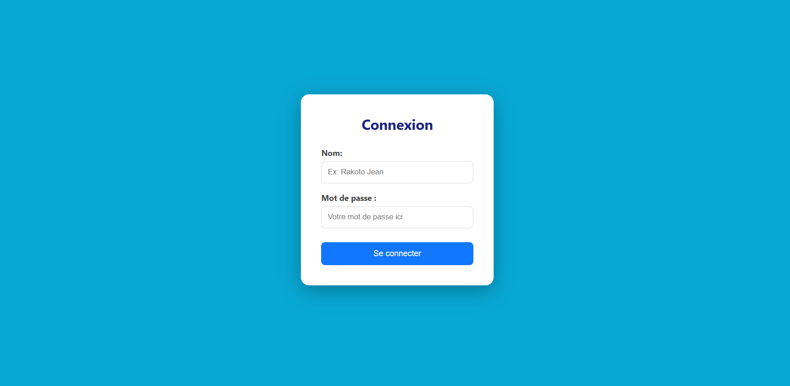
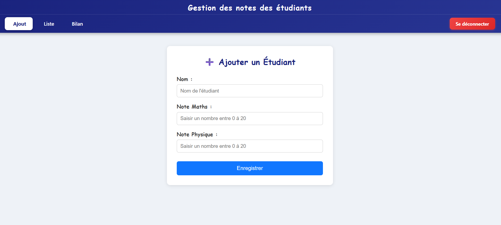
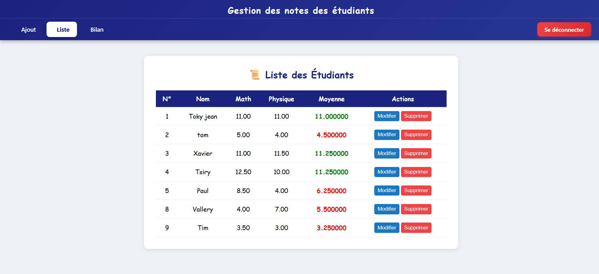
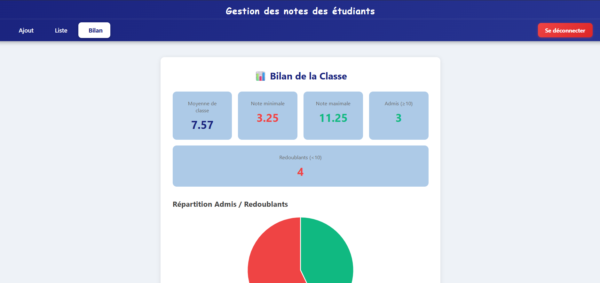

# Gestion des notes des étudiants 📜

Application web (SPA) pour gérer les étudiants et leurs notes.
Frontend en Vue 3, API REST en PHP, base de données MySQL.

## Fonctionnalités

- [Ajouter, modifier et supprimer un étudiant]
- [Saisir et consulter les notes]
- [Diagramme pour la moyenne, le statut des notes des etudiants.]

## Technologies

| Partie | Technologie |
|--------|-------------|
| Frontend | Vue 3, Vite |
| Backend | PHP (dossier `etudiant-api`) |
| SGBD | MySQL |
| Qualité du code | ESLint, Prettier |

## Structure du projet

    ├── src/            # code du frontend Vue
    ├── public/         # fichiers statiques
    ├── etudiant-api/   # API PHP
    └── database.sql    # script de création de la base

## Installation

### Prérequis

- [XAMPP](https://www.apachefriends.org/) (Apache + MySQL)
- [Node.js](https://nodejs.org/)
- Git

### Étapes

1. Cloner le dépôt :

```bash
   git clone https://github.com/donat-tsiry/Gestion-notes-desetudiants.git
   cd Gestion-notes-desetudiants
```

2. Démarrer **Apache** et **MySQL** depuis le panneau de contrôle XAMPP.

3. Créer la base de données :
   - ouvrir `http://localhost/phpmyadmin` ;
   - importer le fichier `database.sql`.

4. Copier le dossier `etudiant-api` dans `C:\xampp\htdocs\`.

5. Vérifier la connexion MySQL dans `etudiant-api/config.php`
   (par défaut sous XAMPP : utilisateur `root`, mot de passe vide).

6. Installer et lancer le frontend :

```bash
   npm install
   npm run dev
```

7. Ouvrir l'adresse affichée dans le terminal (en général `http://localhost:5173`).

   ## Captures d'écran

   
   
   
   
## Auteur

**Donat Tsiry**, étudiant à l'École nationale d'informatique (Fianarantsoa Madagascar)

GitHub : [@donat-tsiry](https://github.com/donat-tsiry)
